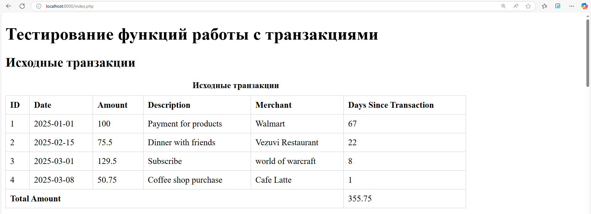
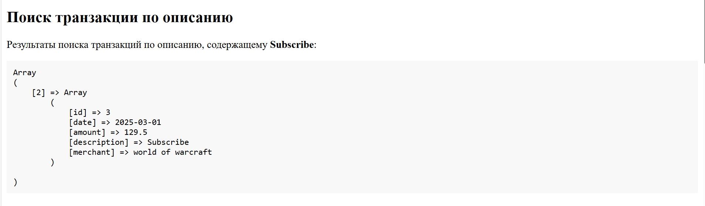
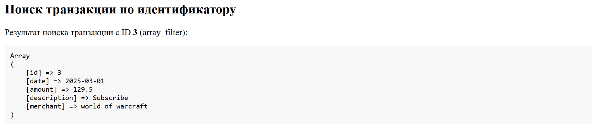
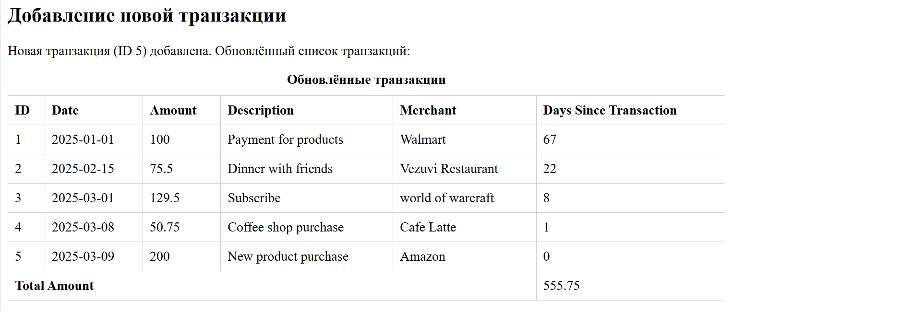
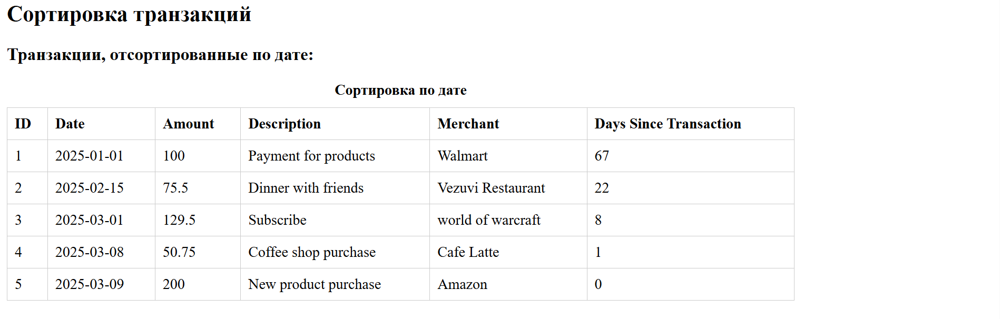
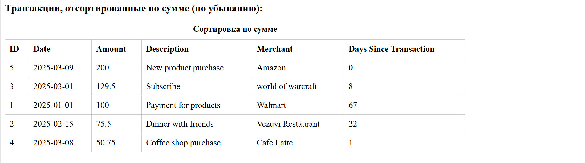
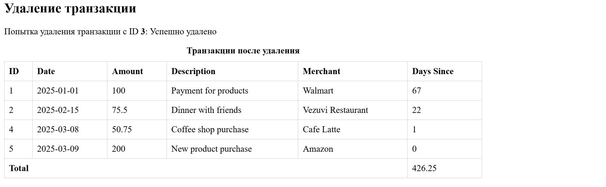
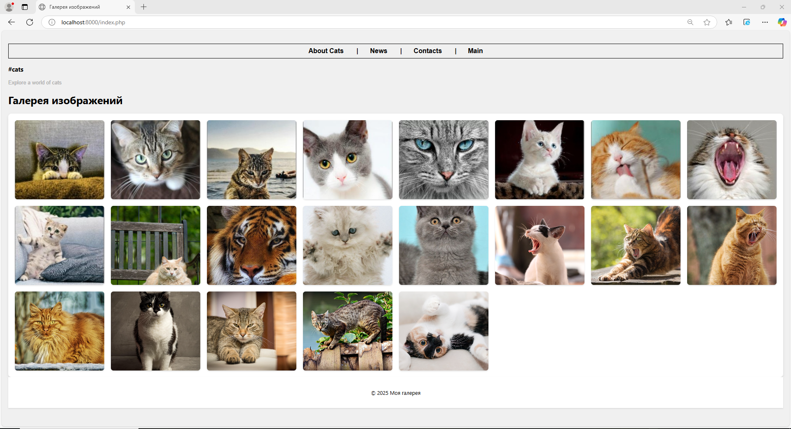

# Лабораторная работа №3: Массивы и Функции

**Выполнил:** Zabudico AlexAandr

**Группа:** I-2302*ru*ș.e.

**Дата:** 09.03.2024

## Инструкции по запуску проекта

### Требования:

- PHP 8.0+
- Веб-сервер (Apache/Nginx)
- Браузер с поддержкой HTML5/CSS3

### Шаги:

1. Клонировать репозиторий:
   ```bash
   git clone https://github.com/zabudico/LL_03_PHP.git
   cd LL_03_PHP
   ```
2. Создать директорию `image` и добавить 20-30 изображений в формате `.jpg`
3. Запустить веб-сервер:
   ```bash
   PS C:\Users\User\Desktop\LL_03_php> cd part_1
   PS C:\Users\User\Desktop\LL_03_php\part_1> php -S localhost:8000 -t public
   [Sun Mar  9 23:04:04 2025] PHP 8.3.13 Development Server (http://localhost:8000) started
   ```
4. Открыть в браузере:
   - Управление транзакциями: `http://localhost:8000/transactions.php`
   - Галерея изображений: `http://localhost:8000/gallery.php`

---

## Описание лабораторной работы

### Цель:

1. Освоить работу с массивами и функциями в PHP.
2. Реализовать систему управления банковскими транзакциями.
3. Создать адаптивную галерею изображений.

### Задание 1: Управление транзакциями

- Создание/удаление транзакций
- Сортировка по дате и сумме
- Поиск по описанию и ID
- Расчет общего баланса и дней с момента транзакции















### Задание 2: Галерея изображений

- Динамическая загрузка изображений из директории
- Адаптивный дизайн с CSS Grid
- Эффекты анимации при наведении

```bash

PS C:\Users\User\Desktop\LL_03_php\part_1> cd ..
PS C:\Users\User\Desktop\LL_03_php> cd part_2
PS C:\Users\User\Desktop\LL_03_php\part_2> php -S localhost:8000 -t public
[Sun Mar  9 23:08:42 2025] PHP 8.3.13 Development Server (http://localhost:8000) started
[Sun Mar  9 23:08:46 2025] 127.0.0.1:53181 Accepted
[Sun Mar  9 23:08:46 2025] 127.0.0.1:53181 [200]: GET /index.php
[Sun Mar  9 23:08:46 2025] 127.0.0.1:53181 Closing
[Sun Mar  9 23:08:46 2025] 127.0.0.1:53182 Accepted
[Sun Mar  9 23:08:46 2025] 127.0.0.1:53182 [200]: GET /css/style.css
[Sun Mar  9 23:08:46 2025] 127.0.0.1:53182 Closing
[Sun Mar  9 23:08:47 2025] 127.0.0.1:53188 Accepted
[Sun Mar  9 23:08:47 2025] 127.0.0.1:53188 [200]: GET /image/img_92.jpg
[Sun Mar  9 23:08:47 2025] 127.0.0.1:53188 Closing
[Sun Mar  9 23:08:47 2025] 127.0.0.1:53190 Accepted
[Sun Mar  9 23:08:47 2025] 127.0.0.1:53191 Accepted
[Sun Mar  9 23:08:47 2025] 127.0.0.1:53192 Accepted
[Sun Mar  9 23:08:47 2025] 127.0.0.1:53193 Accepted
[Sun Mar  9 23:08:47 2025] 127.0.0.1:53194 Accepted
[Sun Mar  9 23:08:47 2025] 127.0.0.1:53190 [200]: GET /image/img_94.jpg
[Sun Mar  9 23:08:47 2025] 127.0.0.1:53191 [200]: GET /image/img_95.jpg
[Sun Mar  9 23:08:47 2025] 127.0.0.1:53192 [200]: GET /image/img_999.jpg
[Sun Mar  9 23:08:47 2025] 127.0.0.1:53193 [200]: GET /image/img_9999.jpg
[Sun Mar  9 23:08:47 2025] 127.0.0.1:53194 [200]: GET /image/img_96.jpg
[Sun Mar  9 23:08:47 2025] 127.0.0.1:53190 Closing
[Sun Mar  9 23:08:47 2025] 127.0.0.1:53191 Closing
[Sun Mar  9 23:08:47 2025] 127.0.0.1:53192 Closing
[Sun Mar  9 23:08:47 2025] 127.0.0.1:53193 Closing
[Sun Mar  9 23:08:47 2025] 127.0.0.1:53194 Closing
[Sun Mar  9 23:08:47 2025] 127.0.0.1:53200 Accepted
[Sun Mar  9 23:08:47 2025] 127.0.0.1:53200 [200]: GET /image/img_999999.jpg
[Sun Mar  9 23:08:47 2025] 127.0.0.1:53200 Closing
[Sun Mar  9 23:08:47 2025] 127.0.0.1:53202 Accepted
[Sun Mar  9 23:08:47 2025] 127.0.0.1:53202 [200]: GET /image/img_9999999999.jpg
[Sun Mar  9 23:08:47 2025] 127.0.0.1:53203 Accepted
[Sun Mar  9 23:08:47 2025] 127.0.0.1:53202 Closing
[Sun Mar  9 23:08:47 2025] 127.0.0.1:53204 Accepted
[Sun Mar  9 23:08:47 2025] 127.0.0.1:53205 Accepted
[Sun Mar  9 23:08:47 2025] 127.0.0.1:53206 Accepted
[Sun Mar  9 23:08:47 2025] 127.0.0.1:53203 [200]: GET /image/img_7.jpg
[Sun Mar  9 23:08:47 2025] 127.0.0.1:53204 [200]: GET /image/img_99.jpg
[Sun Mar  9 23:08:47 2025] 127.0.0.1:53205 [200]: GET /image/img_9.jpg
[Sun Mar  9 23:08:47 2025] 127.0.0.1:53206 [200]: GET /image/img_98.jpg
[Sun Mar  9 23:08:47 2025] 127.0.0.1:53203 Closing
[Sun Mar  9 23:08:47 2025] 127.0.0.1:53204 Closing
[Sun Mar  9 23:08:47 2025] 127.0.0.1:53205 Closing
[Sun Mar  9 23:08:47 2025] 127.0.0.1:53206 Closing
[Sun Mar  9 23:08:47 2025] 127.0.0.1:53212 Accepted
[Sun Mar  9 23:08:47 2025] 127.0.0.1:53212 [200]: GET /image/img_93.jpg
[Sun Mar  9 23:08:47 2025] 127.0.0.1:53212 Closing
[Sun Mar  9 23:08:47 2025] 127.0.0.1:53214 Accepted
[Sun Mar  9 23:08:47 2025] 127.0.0.1:53214 [200]: GET /image/img_97.jpg
[Sun Mar  9 23:08:47 2025] 127.0.0.1:53214 Closing
[Sun Mar  9 23:08:47 2025] 127.0.0.1:53215 Accepted
[Sun Mar  9 23:08:47 2025] 127.0.0.1:53217 Accepted
[Sun Mar  9 23:08:47 2025] 127.0.0.1:53218 Accepted
[Sun Mar  9 23:08:47 2025] 127.0.0.1:53215 [200]: GET /image/img_8.jpg
[Sun Mar  9 23:08:47 2025] 127.0.0.1:53217 [200]: GET /image/img_1.jpg
[Sun Mar  9 23:08:47 2025] 127.0.0.1:53218 [200]: GET /image/img_2.jpg
[Sun Mar  9 23:08:47 2025] 127.0.0.1:53219 Accepted
[Sun Mar  9 23:08:47 2025] 127.0.0.1:53215 Closing
[Sun Mar  9 23:08:47 2025] 127.0.0.1:53219 [200]: GET /image/img_3.jpg
[Sun Mar  9 23:08:47 2025] 127.0.0.1:53217 Closing
[Sun Mar  9 23:08:47 2025] 127.0.0.1:53218 Closing
[Sun Mar  9 23:08:47 2025] 127.0.0.1:53219 Closing
[Sun Mar  9 23:08:48 2025] 127.0.0.1:53221 Accepted
[Sun Mar  9 23:08:48 2025] 127.0.0.1:53221 [200]: GET /image/img_4.jpg
[Sun Mar  9 23:08:48 2025] 127.0.0.1:53221 Closing
[Sun Mar  9 23:08:48 2025] 127.0.0.1:53222 Accepted
[Sun Mar  9 23:08:48 2025] 127.0.0.1:53222 [200]: GET /image/img_5.jpg
[Sun Mar  9 23:08:48 2025] 127.0.0.1:53222 Closing
[Sun Mar  9 23:08:48 2025] 127.0.0.1:53223 Accepted
[Sun Mar  9 23:08:48 2025] 127.0.0.1:53223 [200]: GET /image/img_6.jpg
[Sun Mar  9 23:08:48 2025] 127.0.0.1:53223 Closing

```



---

## Краткая документация к проекту

### Part_1 : Управление транзакциями (`functions.php`)

| Функция                        | Параметры                                   | Возвращаемое значение | Описание                              |
|--------------------------------|---------------------------------------------|------------------------|---------------------------------------|
| `calculateTotalAmount`         | `array $transactions`                       | `float`                | Сумма всех транзакций                 |
| `findTransactionByDescription` | `string $descriptionPart`                   | `array`                | Поиск по части описания               |
| `findTransactionById`          | `int $id`                                   | `array|null`           | Поиск по ID через `array_filter`      |
| `daysSinceTransaction`         | `string $date`                              | `int`                  | Расчет дней с даты транзакции         |
| `addTransaction`               | `int $id, string $date, float $amount, ...` | `void`                 | Добавление с валидацией данных        |
| `deleteTransactionById`        | `int $id`                                   | `bool`                 | Удаление с переиндексацией массива    |

### Part_2: Галерея изображений (`functions.php`)

```php

<?php
/**
 * Функции для работы с галереей изображений.
 */

/**
 * Возвращает массив путей к изображениям .jpg в указанной директории.
 *
 * @param string $dir Путь к директории с изображениями относительно корня проекта.
 * @return array Массив путей к изображениям или пустой массив, если директория не существует или нет изображений.
 */
function getImages($dir)
{
    // Проверяем, существует ли директория
    if (!is_dir($dir)) {
        return [];
    }

    // Сканируем содержимое директории
    $files = scandir($dir);
    if ($files === false) {
        return [];
    }

    $images = [];
    // Перебираем все файлы в директории
    foreach ($files as $file) {
        // Пропускаем текущий (.) и родительский (..) каталоги, проверяем расширение .jpg
        if ($file != "." && $file != ".." && strtolower(pathinfo($file, PATHINFO_EXTENSION)) == 'jpg') {
            $images[] = $dir . '/' . $file;
        }
    }

    return $images;
}
```

```php

//index.php

<?php
require_once 'includes/functions.php';

// Путь к директории с изображениями относительно корня public
$imageDir = 'image';
$images = getImages($imageDir);
?>

<?php include 'header.php'; ?>


<main>
    <h1>Галерея изображений</h1>
    <?php if (empty($images)): ?>
        <p>Изображения не найдены. Пожалуйста, проверьте директорию <code>image</code>.</p>
    <?php else: ?>
        <div class="gallery">
            <?php foreach ($images as $image): ?>
                " alt="Изображение">
            <?php endforeach; ?>
        </div>
    <?php endif; ?>
</main>

<?php include 'footer.php'; ?>


```

---

## Примеры использования проекта

### 1. Вывод транзакций с подсчётом дней

```php
foreach ($transactions as $transaction) {
    echo "<tr>
        <td>{$transaction['id']}</td>
        <td>{$transaction['date']}</td>
        <td>\${$transaction['amount']}</td>
        <td>".daysSinceTransaction($transaction['date'])." дней</td>
    </tr>";
}
```

**Результат:**  
Таблица с колонками: ID, Дата, Сумма, Дней с транзакции.

---

### 2. Добавление транзакции с обработкой ошибок

```php
try {
    addTransaction(5, "2024-03-15", 199.99, "Netflix", "Онлайн подписка");
} catch (InvalidArgumentException $e) {
    echo "<div class='error'>{$e->getMessage()}</div>";
}
```

**Проверки:**

- Уникальность ID
- Формат даты (`YYYY-MM-DD`)
- Положительная сумма

---

### 3. Адаптивная галерея изображений

```html
<div class="gallery">
  <?php foreach (getImages('image') as $img): ?>
  " alt="Cat" class="gallery-img" />
  <?php endforeach; ?>
</div>
```

**Стили CSS:**

```css
.gallery {
  display: grid;
  grid-template-columns: repeat(auto-fill, minmax(240px, 1fr));
  gap: 20px;
}

.gallery-img {
  transition: transform 0.3s;
  height: 240px;
  object-fit: cover;
}
```

---

## Ответы на контрольные вопросы

1. **Что такое массивы в PHP?**  
   Массивы — упорядоченные коллекции элементов, доступные по индексу (числовой массив) или ключу (ассоциативный массив). Могут содержать элементы разных типов.

2. **Способы создания массива:**

   - Короткий синтаксис: `$arr = [1, 2, 3];`
   - Функция `array()`: `$assoc = array('id' => 1, 'name' => 'Test');`
   - Динамическое добавление: `$arr[] = 'Новый элемент';`

3. **Цикл foreach:**  
   Используется для итерации по массивам:
   ```php
   foreach ($array as $key => $value) {
       echo "Ключ: $key, Значение: $value";
   }
   ```

---

## Список использованных источников

1. Официальная документация PHP: [php.net/manual/ru](https://www.php.net/manual/ru/)
2. Руководство по CSS Grid: [MDN Web Docs](https://developer.mozilla.org/ru/docs/Web/CSS/CSS_Grid_Layout)
3. Руководство по безопасности OWASP: [OWASP Cheat Sheet](https://cheatsheetseries.owasp.org/cheatsheets/PHP_Security_Cheat_Sheet.html)

---

## Дополнительные аспекты

1. **Безопасность:**

   - Экранирование вывода через `htmlspecialchars()`
   - Валидация входных параметров в функциях
   - Обработка исключений через `try/catch`

2. **Производительность:**

   - Использование `array_filter` вместо циклов для поиска
   - Кэширование списка изображений в галерее

3. **Адаптивность:**
   - Медиа-запросы для мобильных устройств:
     ```css
     @media (max-width: 768px) {
       .gallery-img {
         height: 150px;
       }
     }
     ```

```

```
